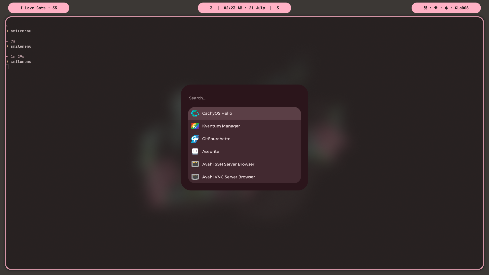
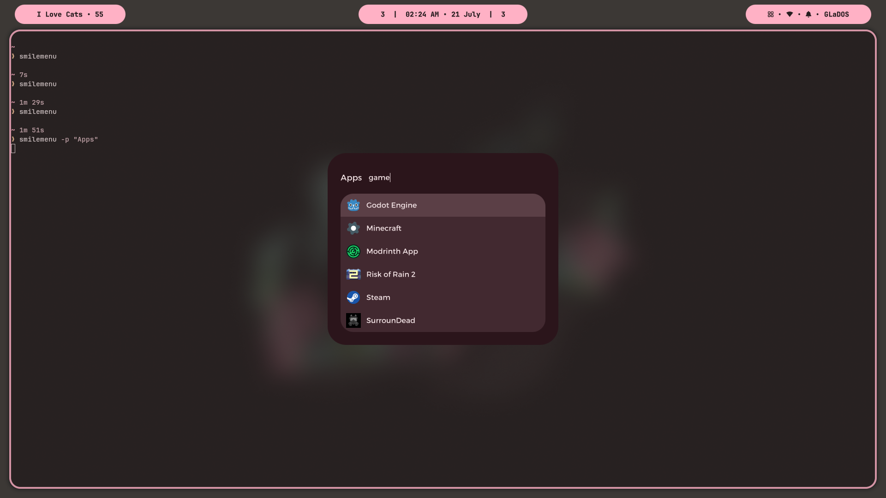

# ⚠️ Note First

I am not willing to accept contributions. I made this project for myself, but I'm making it public, because why not. You can use it.

---

# ❤️ SmileMenu

**A modern Qt application launcher for Linux.**

SmileMenu is a lightweight launcher. It supports desktop applications, custom scripts, providers, dmenu-style input, history, fuzzy search, basic theming, and dynamic configuration.

### Features

- Native Qt/QML interface
- Wayland layer-shell support
- Desktop application launcher
- Fuzzy searching
- Application category searching
- Application history
- Custom script runners
- Provider system (`list` / `run`)
- dmenu-compatible mode
- Configurable prompts
- Dynamic window sizing
- JSON configuration & theming


---

# 🏞️ Screenshots

<table>
  <tr>
    <td align="center">
      
    </td>
    <td align="center">
      
    </td>
  </tr>
</table>


---

# ⭐ Usage

Read from [WIKI.md](https://codeberg.org/SmileLulz/SmileMenu/src/branch/main/WIKI.md)


---

## 📌 Runtime Requirements (Arch Linux)

- `python`
- `pyside6`
- `qt6-base`
- `qt6-declarative`
- `shiboken6`
- `layer-shell-qt`

```sh
sudo pacman -S --needed python pyside6 qt6-base qt6-declarative shiboken6 layer-shell-qt
```


---

# ⚙️ Build & Installation

**IMPORTANT:** All below guides are wrote for Arch Linux only.


### Running from source

Clone the repository:

```sh
git clone https://codeberg.org/SmileLulz/SmileMenu.git
cd SmileMenu
```

Run:

```sh
python -m smilemenu
```


### Build for any distro (python pip)

Build the package:

```sh
python -m build
```

Install locally:

```sh
python -m pip install .
```

For development:

```sh
python -m pip install -e .
```


### Build for Arch

Dependencies:
- `python`
- `python-pip`
- `python-build`
- `python-installer`
- `python-wheel`
- `python-setuptools`

```sh
sudo pacman -S --needed python python-pip python-build python-installer python-wheel python-setuptools
```

Build the package:

```sh
makepkg -fcC
```

Install locally:

```sh
sudo pacman -U smilemenu-x.x.x-1-any.pkg.tar.zst
```


### Build for Debian

Dependencies:

The Debian package can be built using a Debian container. This avoids installing Debian packaging tools on Arch or any non-Debian distro.

- `podman` (or Docker)

```sh
sudo pacman -S podman
```

Build and run the container from the SmileMenu source directory:

```sh
podman run -it --rm -v "$PWD:/src" -w /src debian:stable bash
```

Install dependencies inside the container:

```sh
apt update
```

```sh
apt install -y \
    build-essential \
    debhelper \
    devscripts \
    python3 \
    python3-build \
    python3-installer \
    python3-setuptools \
    python3-wheel
```

Build the package:

```sh
dpkg-buildpackage -us -uc -tc && mv ../smilemenu_*.deb .
```

Install locally inside the container if you want to:

```sh
apt install ./smilemenu_x.x.x-1_all.deb
```

Exit the container using `exit` command after you're done.
